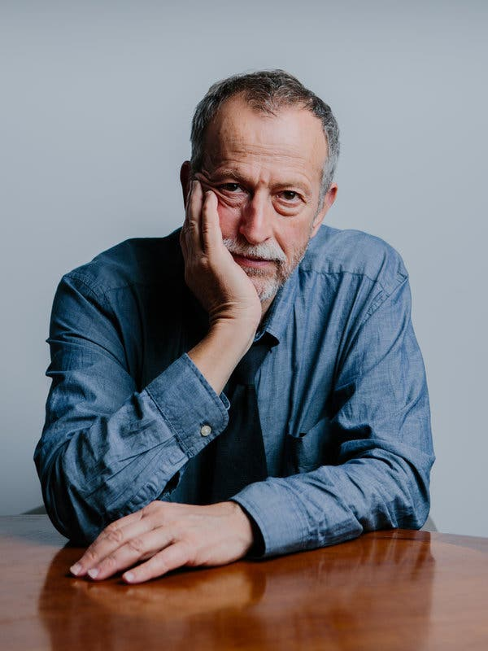

# IASC 2P02 / Luke Fantini

## About Me

I am a Interactive Arts and Science Student at Brock University. Welcome to my Acedemic Blog! I will discussing the Ramsay and Drucker critiques of Moretti and their argument that digital humanities should not always rely on set datasets to evauluate. I think that if Digital Humanities wants to scale up in the academic fields it must be useful in analysing specific data not inteprative capta. Morreti argues the future of Digital Humanities and in this blog I will further examine how he is correct.

## Blog Post

First Sentence of Blog Post Goes Here..... [continue_reading](blog.me/)
